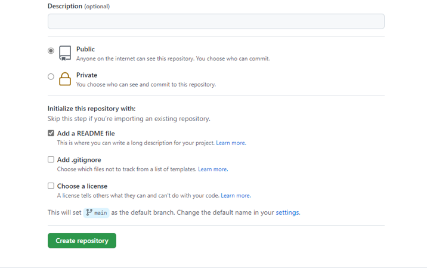
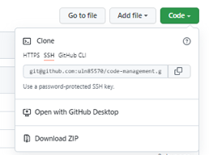

# Source Code Management with Github

The below markdown file consists of lab instructions and notes that will help you to complete the lab - Github and Cloud9 setup using Personal Access Token.

## Group Information

The following people have contributed to the development and delivery of this lab. 

• Udaya Nandipati - 700718557 - uln85570@ucmo.edu

• Venkata Mounika Bhargavi Regati- 700719844 - vxr98440@ucmo.edu

## Important Links

• Github URL - https://github.com/uln85570/code-management/tree/master

## Group Work Together

We both have worked alongside in every level to complete these labs. Below is how we shared our work and which led us to build rapport with eachother.

• We first started with Github and Cloud9 setup using Personal Access Token. Udaya have created python file and pushed to github while Mounika have created flask file and pushed it to github. This lab have taken around 30 minutes each to complete the lab.

• For Github and Cloud9 setup using SSH, we shared the vice versa - Mounika have created the python file and did required changes and pushed to github and Udaya have created the flask file and pushe dto github. This lab took only 20 minutes as we already done few steps in earlier lab.

• Creating README and other files took us arround 1.30 hour for wrapping up everything

• Through this lab we were able to transfer knowledge to each other by showing what the correct process is, how it is done, and passing on the skills through the fitst lab that we did. This helped us to do our 2nd lab using SSH.

## Project Introduction 

This is all about Code Management with Github. You will be using Github individually and collaboratively. We will set up our Cloud9 EC2 to be able to communicate with your Github account. You'll be able to copy code from a remote source (Github) and make changes to it on your personal virtual machine (Cloud9).

## Major Steps

1. Clone Github repositories through their Cloud 9 Environment.
2. Clone via HTTP and SSH.
3. Push to and pull from a Github repository.

### Create a Github Account

[Create a Github Account](https://github.com/join). If you already have one, you can skip to the next step.

### Configure Github in the AWS Terminal

1. Open up your Cloud9 environment. Run the following lines in the terminal, replacing the username and email with your Github username and email:

```sh
git config --global user.name "Your Github Username"
git config --global user.email "Your Github Email Address"
git config --global credential.helper store
```

### Create a Repository on Github

1. Navigate to Github in the browser and log in. On the left, click the button to create a new repository.


2. Name your repository. Create the repository.



### Using Personal Access Token

1. Go to Cloud9 terminal and clone the repository and create python environment


2. Push the changes back up to Github using best practices. In the terminal, run:
```sh
git status
git add << your filename>>
git commit -m "<<your comment>>"
git push
```

### Add SSH Key

While we're configuring GitHub, we should add a new SSH key. 

1. First, check if you already have an SSH key by running `cat ~/.ssh/id_rsa.pub`. If the terminal prints out a long string of characters starting with ssh-rsa, you've already got a key.

2. If the running previous step printed "No such file or directory", then run `ssh-keygen` to create a key. Leave everything blank and press enter for the default location and no passphrase. You should be prompted to select a file and passphrase for your new key. Leave everything blank and press enter for the default location and no passphrase. If you’re asked if you want to overwrite, then you already have an SSH key, and you do not want to overwrite it. If you've done every correctly, you should be something like this printed to your terminal:


Run `cat ~/.ssh/id_rsa.pub` in your terminal. Copy the output (starting from `ssh-rsa`). You'll need it for the next step

3. Navigate to the homepage of Github in your browser. Go to your account settings:


Click "SSH and GPG Keys":


Click the "New SSH key" button:


Put whatever you want for the title, but preferably something related to C9 since that's the machine that has this key. Paste the key in the text area and click "Add SSH key".


### Clone Using SSH

1. Go back to your repository on Github. Then, click on the Code button and make sure the pop-up has "SSH" underlined and selected. The url should start with `git@github.com:...`. If this is not the case, click the link that say `SSH`. Copy that URL in the text box.



2. Back in your Cloud9 terminal, `cd` into your folder and clone down the project using `git clone <ssh_url>`, using the URL you copied from the previous step. If asked, "Are you sure you want to continue connecting", type `yes`. Then change directory into your project or whatever you named your repository. 

3. Once your repo can been cloned down, use the Cloud9 IDE to update the file inside of your project. **Add your own code**. Be sure to save the file.

4. Push the changes back up to Github using best practices. In the terminal, run:
```sh
git status
git add << your filename>>
git commit -m "<<your comment>>"
git push
```
5. Go back to Github to view your repository in the browser. Refresh the page and confirm that you see your newly added!


## Repository Contents

The github repository contains detailed documentation and steps for understanding and conquering this lab.

• Step-by-Step Document for completing the labs

• Files to download and test
